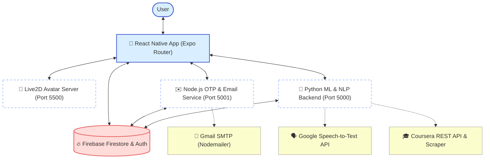

# SPACE: AI-Based Career Guidance & Recommendation System

SPACE is a modern, intelligent career guidance and recommendation ecosystem designed to support both **Job Seekers** and **Employers**. It integrates Machine Learning, Natural Language Processing (NLP), dynamic web scraping, and a virtual digital human avatar to deliver personalized career recommendations, detailed skill gap analyses, automated resume generation, and realistic mock interview training.

---

## 🏗️ System Architecture

The SPACE system is built using a decoupled, multi-service architecture that runs concurrently for local development:



### System Services Breakdown
1. **Frontend App (Expo Router)**: An iOS/Android cross-platform application utilizing React Native, styled with a modern, clean UI, incorporating Lottie animations, tab routing, and responsive screens.
2. **Python Flask Backend (Port 5000)**: Houses the machine learning classifiers, NLP interview assessment logic, and integration wrappers for speech processing and web scrapers.
3. **Node.js Express Server (Port 5001)**: Dedicated authentication assistance utility that issues and validates verification OTP codes via SMTP and handles account updates.
4. **Live2D Server (Port 5500)**: Serves the WebGL canvas and JavaScript SDK containing the interactive digital human model inside the app's Webview interface.
5. **Google Firebase Services**: Supports Authentication, profile management, and stores dynamic lists (jobs, universities, courses, OTP codes).

---

## ✨ Core Features

### 1. 🤖 AI-Powered Career Recommendation
* **ML Classification**: Uses a trained Multi-Layer Perceptron (MLP) Classifier model (`job_category_mlp_sklearn.pkl`) matching a user's `skills` and `field_of_study` to predict their ideal career focus area.
* **Match Calculation**: Dynamically computes overlap between user profiles and job requirements stored in Firebase, outputting a precise `match_percent` and identifying specific matched skills.
* **Smart Filter & Search**: Allows users to filter matched and overall jobs by category chips or locations with live auto-suggestions.

### 2. 🎓 Skill Gap Analysis & Coursera Learning Paths
* **Dynamic Skill Gaps**: Maps predicted career categories directly to Coursera domains (e.g. *Information Technology*, *Data Science*, *Business*).
* **Data-driven Vocabulary**: Extracts the most common skills from relevant domain courses in Firestore.
* **Personalized Courses**: Highlights missing skills (skill gap) and recommends matching Coursera courses, sorted by difficulty levels (Beginner, Intermediate, Advanced) and skill-coverage ratio.

### 3. 🎙️ Voice-Supported Interactive Mock Interviews
* **Digital Interviewer**: Features an animated Live2D Cubism model (Haru) served locally and hosted in a React Native Webview that blinks, moves, and acts as the mock interviewer.
* **Speech-to-Text Processing**: Decodes base64 microphone inputs into PCM WAV buffers using a local `ffmpeg` path, calling Google Speech-to-Text API for transcription.
* **Hybrid Semantic Evaluation**: Scores user answers based on:
  * **Semantic Similarity**: Hybrid calculation combining TF-IDF cosine similarity (30%) and deep Sentence Transformer (`all-MiniLM-L6-v2`) embeddings (70%).
  * **Keyword Coverage**: Detects occurrences of essential concepts.
  * **Response Length Quality**: Evaluates answer word counts against optimal guidelines (penalizing extremely short or long answers).
* **Feedback Grades**: Classifies mock responses into grading tiers: *Excellent*, *Good*, *Fair*, or *Needs Improvement*.

### 4. 📄 Automated Resume Builder
* **Template Generation**: Merges educational records, language proficiencies, career history, and skillsets into a styled HTML resume template (`assets/resume.html`).
* **PDF Printing**: Compiles the template into a clean PDF using `expo-print`.
* **Native Sharing**: Directly invokes the system share sheet using `expo-sharing` to download or send the PDF.

### 5. 📧 Secure OTP Email Verification
* **Password Recovery / Register**: Verifies registration and password resets using Nodemailer to send securely generated 6-digit OTP codes.
* **Firestore Expiration**: Stores codes with a 10-minute validity timestamp for validation before clearing.

---

## 🛠️ Technology Stack

| Layer | Technologies & Libraries |
| :--- | :--- |
| **Frontend Mobile** | React Native, Expo SDK 54, Expo Router, React Navigation, TypeScript, Zustand (State), Lottie React Native |
| **Python ML Backend** | Python 3.10+, Flask, scikit-learn (MLP Classifier, LabelEncoder), SentenceTransformers (`all-MiniLM-L6-v2`), NumPy, Pandas, BeautifulSoup4, Pydub |
| **Node.js Utility** | Node.js, Express, Nodemailer, Firebase Admin SDK, CORS, Dotenv |
| **Avatar Engine** | Cubism Live2D Web SDK, Live-Server (WebGL) |
| **Database & Auth** | Google Firebase (Firestore, Authentication) |

---

## 📂 Project Structure

```text
SpaceCareer/
├── .expo/                       # Expo development configurations
├── _node_email/                 # Express backend for Nodemailer OTP
│   ├── auth_route.js            # OTP sending/verifying and password resets
│   ├── firebase_admin.js        # Firebase admin SDK init
│   └── server.js                # Express entry point (Port 5001)
├── android/                     # Android native builds
├── app/                         # Expo Router App folder (file-based)
│   ├── (job-seekerTabs)/        # Job seeker main dashboard tabs
│   │   ├── courses.tsx          # Coursera courses list
│   │   ├── home.tsx             # Main dashboard (Recommended & search)
│   │   ├── learn.tsx            # Learning paths & Skill gap UI
│   │   └── profile.tsx          # User profile view
│   ├── auth-page/               # Account selector, registration & login flow
│   ├── job-seeker-page/         # Details views (interview screen, resume, etc.)
│   │   ├── autoGenerateResume.tsx # Resume builder & PDF exporter
│   │   ├── interviewScreen.tsx    # Live2D mock interview UI
│   │   └── skillGapDetails.tsx    # Detailed list of missing skills
│   └── _layout.tsx              # Root stack navigator
├── assets/                      # Application assets
│   ├── live2d/                  # Web GL Live2D files served locally (Port 5500)
│   │   ├── haru/                # Cubism model resource folder
│   │   ├── avatar.html          # Web view rendering canvas and script
│   │   └── live2dcubismcore.min.js
│   ├── resume.html              # HTML skeleton for resume generation
│   └── images/                  # Static application logos and icons
├── components/                  # Reusable React Native UI components
├── constants/                   # Application theme colors, metrics, config
├── python/                      # Flask ML/NLP backend (Port 5000)
│   ├── app.py                   # Main Flask API and endpoints
│   ├── nlp_train.py             # Evaluation models (SentenceTransformer, TF-IDF)
│   ├── ml_career.py             # Dataset matching algorithms
│   └── unique_skills.json       # Vocabulary registry of skills
└── package.json                 # Project scripts and dependencies
```

---

## 🚀 Installation & Setup

### Prerequisites
1. **Node.js** (v18 or above recommended)
2. **Python** (v3.10 or above recommended)
3. **FFmpeg**: Required for audio transcoding.
   * On Windows: Install FFmpeg and place executable in `C:\ffmpeg_tools\ffmpeg.exe` (or adjust lines 35-37 in [python/app.py](file:///c:/Users/USER/SpaceCareer/python/app.py) to point to your directory).
4. **Firebase Project**: Set up a Firebase project, configure Firestore and Authentication, and obtain the following config files:
   * **Client SDK**: Configure inside [firebaseConfig.ts](file:///c:/Users/USER/SpaceCareer/firebaseConfig.ts).
   * **Admin SDK Key**: Generate a service account key JSON file, name it `serviceAccountKey.json`, and place a copy in both:
     * `python/serviceAccountKey.json`
     * `_node_email/serviceAccountKey.json`

### 1. Environment Configurations

#### In `_node_email/.env`:
```env
PORT=5001
MAIL_USER=your-gmail-account@gmail.com
MAIL_PASS=your-gmail-app-specific-password
```
*(Note: Create an App Password in your Google Account security settings rather than using your main account password.)*

#### Root `.env` (Automated IP Configuration):
Because React Native runs on a physical device or emulator, it needs to contact your local computer's network interface instead of `localhost`. 

This process is fully automated. When you run `npm run dev` or `npm start`, the startup script (`scripts/update-ip.js`) automatically scans your network interfaces, detects your computer's current local network IP address (prioritizing Wi-Fi), and writes it to a `.env` file in the root directory:
```env
EXPO_PUBLIC_API_IP=192.168.x.x
```
The application dynamically loads this environment variable (`process.env.EXPO_PUBLIC_API_IP`) to connect the mobile application to all local services without manual editing.

---

### 2. Dependency Installation

From the root project directory, run:
```bash
# Install React Native and development utilities
npm install

# Install Node OTP backend dependencies
cd _node_email
npm install

# Install Python backend dependencies
cd ../python
pip install -r requirements.txt
```
*(Note: Ensure you activate a python virtual environment `venv` in the python directory if preferred.)*

---

### 3. Running the Application

To run the entire suite of services, return to the root folder and execute:
```bash
npm run dev
```

This script uses `concurrently` to launch all four components simultaneously:
* **Python API**: Starts at `http://localhost:5000`
* **Node OTP Service**: Starts at `http://localhost:5001`
* **Live2D Server**: Hosts the avatar at `http://localhost:5500`
* **Expo Metro Bundler**: Boots up the React Native bundler

From the Metro terminal prompt, press:
- `a` to run on Android (via Emulator or connected device).
- `i` to run on iOS Simulator.
- `w` to run in web mode.

---

## 🔌 Flask API Endpoints Reference

### 1. `POST /recommend`
Recommends careers based on skills and academic background.
* **Body (JSON)**:
  ```json
  {
    "skills": ["react native", "typescript", "firebase"],
    "field_of_study": "computer science"
  }
  ```
* **Response (JSON)**:
  ```json
  {
    "predicted_category": "software engineer",
    "recommendations": [
      {
        "job_id": "doc_id_123",
        "job_title": "React Native Developer",
        "category": "Software Engineer",
        "match_percent": 66.67,
        "matched_skills": ["react native", "typescript"]
      }
    ],
    "status": "success"
  }
  ```

### 2. `POST /learning_path`
Finds missing skills and provides matched Coursera courses covering those gaps.
* **Body (JSON)**:
  ```json
  {
    "skills": ["python", "pandas"],
    "field_of_study": "data science"
  }
  ```
* **Response (JSON)**:
  ```json
  {
    "predicted_category": "data scientist",
    "mapped_domain": "Data Science",
    "have_skills": ["python", "pandas"],
    "missing_skills": ["machine learning", "scikit-learn", "deep learning"],
    "courses": [
      {
        "course_id": "machine-learning-specialization",
        "course_title": "Machine Learning Specialization",
        "course_description": "Learn fundamentals...",
        "course_link": "https://www.coursera.org/learn/machine-learning-specialization",
        "provider_names": ["DeepLearning.AI", "Stanford University"],
        "domains": ["Data Science"],
        "covers_skills": ["machine learning"],
        "course_level": "Beginner"
      }
    ]
  }
  ```

### 3. `POST /score_answer`
Grades individual question responses using TF-IDF and semantic Sentence Transformers.
* **Body (JSON)**:
  ```json
  {
    "role": "software_engineer",
    "question_id": 0,
    "user_answer": "In Javascript, a closure is created when an inner function is defined inside an outer function..."
  }
  ```
* **Response (JSON)**:
  ```json
  {
    "role": "software_engineer",
    "question_id": 0,
    "question": "What is a closure in JavaScript?",
    "final_score": 88.5,
    "grade": "Excellent",
    "similarity": {
      "tfidf_similarity": 0.45,
      "semantic_similarity": 0.89,
      "mixed_similarity_score": 75.8
    },
    "keywords": {
      "coverage_score": 90.0,
      "important_keywords": ["closure", "function", "scope", "lexical"],
      "covered_keywords": ["closure", "function", "scope"],
      "missing_keywords": ["lexical"]
    },
    "length": {
      "word_count": 52,
      "length_score": 100.0,
      "note": "Within ideal range"
    },
    "model_answer": "A closure is the combination of a function bundled together..."
  }
  ```

### 4. `POST /speech_to_text`
Transcribes base64-encoded audio voice input utilizing Google STT.
* **Body (JSON)**:
  ```json
  {
    "audioContent": "UklGRiS... [Base64 Encoded Audio File Bytes]",
    "config": {
      "languageCode": "en-US"
    }
  }
  ```
* **Response (JSON)**:
  ```json
  {
    "transcript": "closure is a function that remembers its outer variables",
    "raw": { ... }
  }
  ```

### 5. `GET /scrape_courses`
Triggers Coursera API pagination and HTML web scraping. Courses containing scraped names, levels, skills, and links are dynamically updated in Firestore.
* **Response (JSON)**:
  ```json
  {
    "message": "Courses processed",
    "saved": 12,
    "skipped_existing": 238,
    "total_received": 250,
    "max_new_limit": 250
  }
  ```
